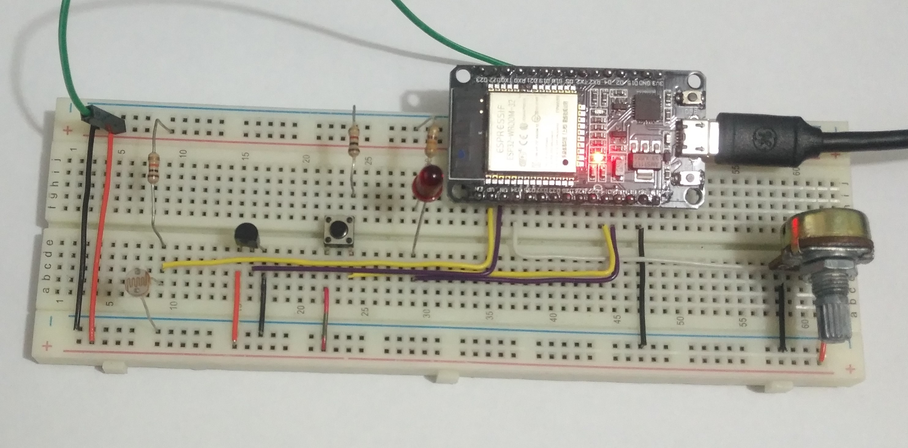
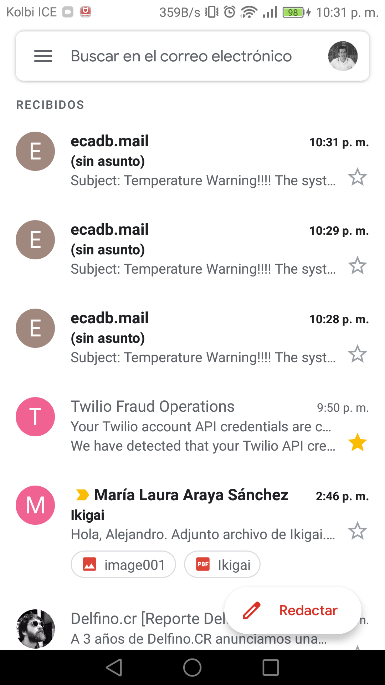
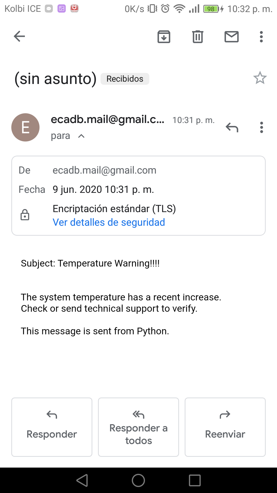
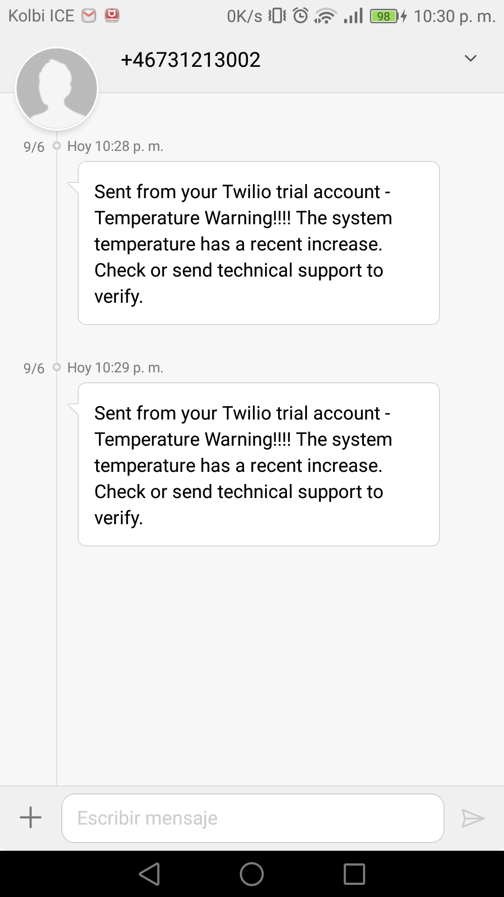

# Proyecto_Final
## Proyecto Final Curso Python UNA

Estudiante: Alejandro Loría Jiménez

El proyecto consiste en el uso de un microcontrolador ESP32, programado con MicroPython para la lectura de un sensor de temperatura y una fotocelda. El sistema toma los valores de ambos sensores cada 30 segundos (para demostración) y los datos son enviado a un PC mediente conexión WiFi a traves de un Socket.

En la PC hay otro programa realizado en Python el cual tiene el servidor para el Socket y recibe la información del microcontrolador. Una vez recibida la información esta se procesa para tener el valor correcto de temperatura e intesidad luminica, luego estos datos son guardados en un archivo CSV agregando una estampa de tiempo. Si la temperatura excede un valor determinado, el programa alerta al usuario enviando un e-mail y SMS para informar el evento.

Para el envio del e-mail se hace uso de la libreria smtplin y ssl.

Para el envio del SMS se hace uso del servicio de Twilio, el cual prove un API para envio de SMS, correo, otros servicios para complementar las aplicaciones que uno crea. Hay que instarlar unos paquetes para que funcione el servicio, la pagina tiene muy buena documentación para poder crear la función para el envío del mensaje. Se uso la versión de prueba y tiene soporte para varios lenguajes de programación.

# Capturas de pantalla

## Circuito para Pruebas

## Bandeja de entrada de correo

## Correo con la alerta

## Bandeja de los SMS

